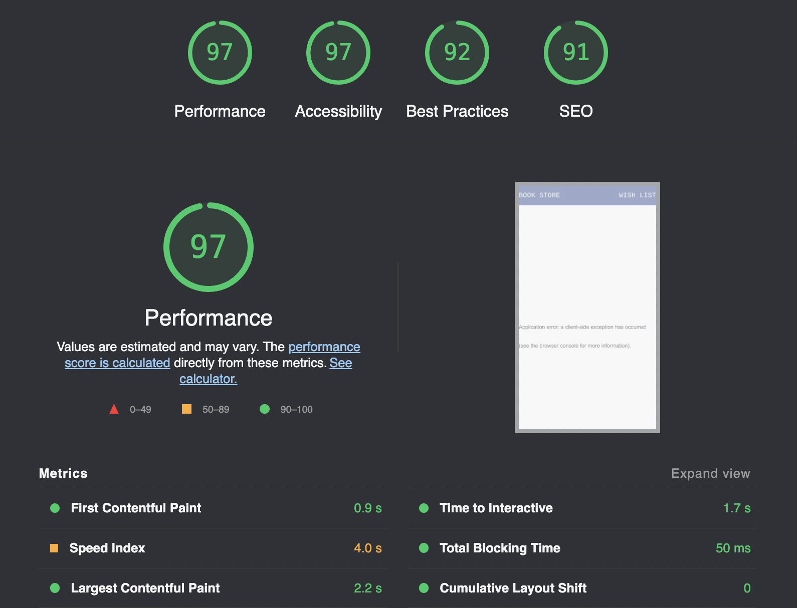

This is a [Next.js](https://nextjs.org/) project that show book from REST API ( [https://booktravelioapi.herokuapp.com/bookhttps://graphql-pokeapi.vercel.app/]()) ( [https://github.com/adiviagp/bookAPI]() )

## Getting Started

First, run the development server:

```bash
npm run dev
# or
yarn dev
```

Open [http://localhost:3000](http://localhost:3000) with your browser to see the result.

## Performance

Test Production ( [https://bookstore-brown.vercel.app]() ) on Lighthouse :



## Project Structure

```
.
├── README.md                # README file
├── next.config.js           # Next JS configuration
├── public                   # Public folder
├── components               # Components
├── redux                    # Redux & slices
├── pages                    # NextJS pages
├── styles                   # Global style
└── tsconfig.json            # TypeScript configuration
```
